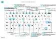

# Краткая справка по сочетаниям клавиш — только ПК

#### Общие

|Нажмите эти клавиши|Действие|  
|-|-|
|Alt+F2 Alt+N Alt+Shift+N Alt+O Alt+Q Alt+Стрелка вверх ALT+СТРЕЛКА ВНИЗ Alt+T Alt+Shift+W Ctrl+Insert Ctrl+Delete Ctrl+Shift+F12 Ctrl+F1 Ctrl+Щелчок Shift+F12 F5/Ctrl+F5 Tab/Shift+Tab F6/Shift+F6 |Отображение и скрытие области информационных панелей Создание новой записи Закрытие вновь созданной записи и создание новой Добавление новой заметки для выбранной записи Открытие **Что вы хотите** Открытие всплывающей подсказки или ошибки проверки Открытие раскрывающегося списка или поля подстановки Открытие страницы **Мои настройки** Открытие текущей карточки или документа в новом окне Вставка новой строки в документ Удаление строки в документе или журнале Развертывание части с позициями (строками) на странице документа Открытие справки для страницы Навигация при персонализации и настройке Открытие обозревателя ролей, обзор функций Обновление или перезагрузка страницы Перемещение фокуса на следующий/предыдущий элемент Переход к следующей экспресс-вкладке/части|

#### Навигация и выбор строк

|Нажмите эти клавиши|Действие|
|-|-|
|Home/End Ctrl+Home/End  Ctrl+Стрелка вверх/вниз Ctrl+A  Ctrl+Пробел Ctrl/Shift+Щелчок мышью Shift+Стрелка вверх или вниз Shift+Page Up/Down Ctrl+Enter|Перейти к первому или последнему полю Перейти к первой или последней строке Навигация без потери выбора Выбрать все Переключение выбора строки  Добавление строки или строк к выделению Добавить строку выше или ниже выделения Выбор видимых строк сверху или снизу  Вывод фокуса из списка|

#### Копирование и вставка

|Нажмите эти клавиши|Действие|
|-|-|
|Ctrl+C/V F8|Копировать/вставить строки Копировать поле выше в текущую строку|

#### Поиск, фильтрация и сортировка

|Нажмите эти клавиши|Действие|
|-|-|
|Alt+F7 F3 Shift+F3 Ctrl+Shift+F3 Alt+F3 Shift+Alt+F3 Ctrl+Alt+Shift+F3|Сортировка столбца в возрастающем или убывающем порядке Переключение поиска Переключение области фильтров; фокусировка на фильтрах полей Переключение области фильтров; фокусировка на фильтрах итоговых значений Фильтр по выбранному значению ячейки Добавить фильтр в выбранное поле Сброс фильтров|

#### Экспресс-ввод

|Нажмите эти клавиши|Действие|
|-|-|
|Ctrl+Shift+Enter Enter/Shift+Enter|Переход к следующему полю экспресс-ввода за пределами списка Переход к следующему/предыдущему полю экспресс-ввода|

##### Предварительный просмотр отчета

|Нажмите эти клавиши|Действие|
|-|-|
|Ctrl+Home/End|Перейти к первой/последней странице|

> [!TIP]
> Для графической версии, пригодной для печати, выберите следующее изображение и скачайте файл PDF.
>
> 
