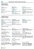

# Работа с [!INCLUDE[d365fin](includes/d365fin_md.md)]
При выполнении бизнес-задач приходится производить разнообразные действия с данными, например создавать записи и вводить данные, сортировать и фильтровать данные, создавать заметки и выводить данные в другие приложения.

Например, можно скорректировать размер и положение любой страницы, увеличить ширину столбцов и высоту заголовков столбцов, а также изменить сортировку данных в столбцах. А если необходимо использовать горизонтальную полосу прокрути для просмотра всех столбцов на странице списка или в строках документа, можно использовать вертикальную область закрепления, чтобы ограничить прокрутку некоторых столбцов.

## Советы и подсказки

> [!TIP]
> Для удобного для печати обзора наиболее часто используемых функций выберите следующее изображение и скачайте файл PDF.
>
> 

## Ссылки для получения дополнительных сведений

В следующей таблице приведены некоторые общие функции со ссылками на разделы, в которых они описываются.

> [!NOTE]
> В дополнение к общим функциям пользовательского интерфейса, описанным в этом разделе, можно использовать другие общие функции, которые более связаны с бизнесом. Дополнительные сведения см. в разделе [Общие бизнес-функции](ui-across-business-areas.md).

| Задача  | Ссылка |
| --- | --- |
|Найдите конкретную страницу, отчет, действие, раздел справки или расширение партнера. |[Поиск страниц и информации с помощью функции "Что вы хотите сделать"](ui-search.md) |
|Просмотр обзора страниц для вашей роли и других ролей, а также переход на эти страницы.|[Поиск страниц с помощью обозревателя ролей](ui-role-explorer.md)|
| Фильтрация данных в представлениях, отчетах или функциях с помощью специальных символов и знаков. |[Сортировка, поиск и фильтрация списков](ui-enter-criteria-filters.md) |
|Познакомьтесь со многими общими функциями, помогающими быстро и просто вводить данные.|[Ввод данных](ui-enter-data.md)|
|Узнайте, как быстро копировать и вставлять данные с помощью сочетаний клавиш.|[Вопросы и ответы по копированию и вставке](ui-copy-paste.md)|
| Просмотр или обработка данных в определенные диапазоны дат. |[Работа с календарными датами и значениями времени](ui-enter-date-ranges.md) |
| См. поля, которые должны быть заполнены. |[Выявление обязательных полей](ui-mandatory-fields.md) |
|Сведения о том, как языковой стандарт компьютера влияет на интерфейс пользователя и сайта Справки, а также о том, как изменить язык.|[Изменение языка и языкового стандарта](about-locale-language.md)|
|Узнайте, как взаимодействовать с Excel практически из любого места в [!INCLUDE[d365fin](includes/d365fin_md.md)]|[Просмотр и редактирование в Excel](across-work-with-excel.md)|
|Прикрепление файлов, добавление ссылок и написание заметок к карточкам и документам.|[Управление вложениями, ссылками и заметками в карточках и документах](ui-how-add-link-to-record.md)|
| Изменение базовых настроек, таких как организация, рабочая дата и ролевой центр. |[Изменение базовых настроек](ui-change-basic-settings.md) |
|Получайте уведомления об определенных событиях или изменениях состояния, например когда собираетесь выставить счет клиенту с просроченной задолженностью.|[Управление уведомлениями](ui-smart-notifications.md)|
| Измените, какие элементы пользовательского интерфейса отображаются и где они отображаются в соответствии с вашими пожеланиями.|[Персонализация рабочей области](ui-personalization-user.md) |
|Определение, предварительный просмотр, печать или сохранение отчетов, а также определение и выполнение пакетных заданий.|[Работа с отчетами, пакетными заданиями и XMLport](ui-work-report.md)|
| Управление содержимым и форматом отчетов и документов, включая то, какие поля данных набора данных отчета отображаются в нем и как они упорядочены, а также стиль текста, изображения и т. д.|[Управление макетами отчетов и документов](ui-manage-report-layouts.md) |
|Знакомство с функциями и возможностями, обеспечиваемыми в [!INCLUDE[d365fin](includes/d365fin_md.md)] для лица с ограниченными возможностями.|[Специальные возможности и сочетания клавиш](ui-accessibility.md)|

## Навигация в Business Central
Здесь приведено короткое видео о том, как перемещаться в [!INCLUDE[d365fin](includes/d365fin_md.md)].

> [!VIDEO https://www.youtube.com/embed/zqz03iMihx0]

## Выбор браузера рабочего стола

[!INCLUDE[prodshort](includes/prodshort.md)] поддерживает несколько браузеров, каждый из которых предлагает различные функции и возможности. Браузер играет важную роль в отзывчивости и плавности пользовательского интерфейса. См. список поддерживаемых, рекомендуемых браузеров для [Business Central Online](https://go.microsoft.com/fwlink/?linkid=2110804) и браузеров для [локальной версии Business Central](https://go.microsoft.com/fwlink/?linkid=2110719).

- По возможности избегайте старых браузеров, таких как Internet Explorer, и переходите на один из рекомендуемых нами современных браузеров, например [новый Microsoft Edge](https://www.microsoft.com/edge/).  

    Internet Explorer все еще поддерживается, но так как теперь новый браузер Microsoft Edge доступен для Windows Server, мы видим снижение уровня использования Internet Explorer. Вы также можете получить [пилотную версию Microsoft Edge в режиме IE](https://www.microsoft.com/edge/business). Дополнительные сведения см. в [документации по Microsoft Edge](https://support.microsoft.com/hub/4337664/microsoft-edge-help).
- Держите ваш браузер всегда обновленным до последней версии.

## См. соответствующее обучение на странице [Microsoft Learn](/learn/paths/work-pro-data-dynamics-365-business-central/)

## См. также

[Приступая к работе](product-get-started.md)  
[Настройка Business Central](setup.md)  
[Общие бизнес-функции](ui-across-business-areas.md)  
[Советы по повышению эффективности для бизнес-пользователей](/dynamics365/business-central/dev-itpro/performance/performance-users?toc=/dynamics365/business-central/toc.json)

## [!INCLUDE[d365fin](includes/free_trial_md.md)]
